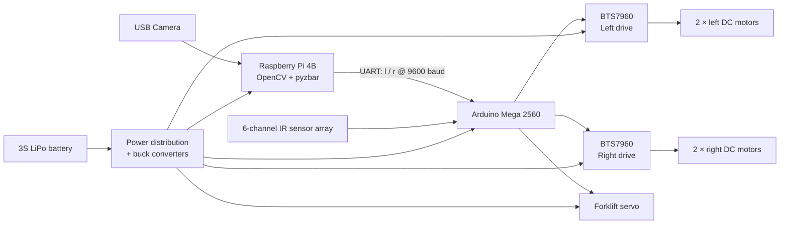
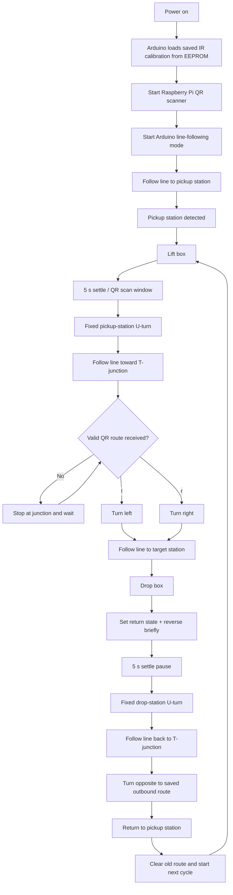
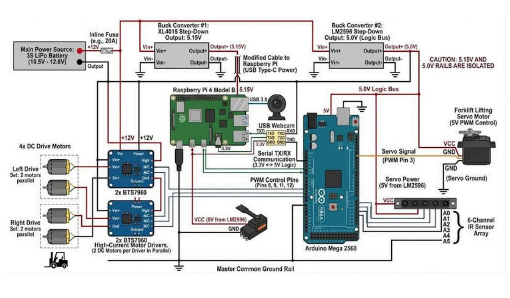

# Vision-Guided Autonomous Forklift

A student-built autonomous material-handling robot that follows a guided line, picks up a box, reads a QR route command with a Raspberry Pi, selects the correct branch at a T-junction, delivers the[...]

> **Project status:** working educational prototype for a controlled track. It is not an industrial forklift, safety-rated AMR, or certified material-handling system.

---

## What the robot does

The robot uses two controllers with separate responsibilities:

- **Raspberry Pi 4B:** USB-camera image acquisition, QR detection/decoding, route-command generation.
- **Arduino Mega 2560:** IR line following, motor control, T-junction handling, fork-servo control, station detection, calibration, and mission state.

A QR code contains only one route character:

| QR content | Action at outbound T-junction |
|---|---|
| `l` | Turn left |
| `r` | Turn right |

On the return trip, the Arduino automatically uses the opposite turn so the robot can return to the pickup branch.

---

## System overview



The Raspberry Pi does not directly drive the motors. It sends the decoded route to the Arduino, while the Arduino handles real-time movement and station/junction behavior.

---

## Mission flow

The following flow matches the current QR-based firmware logic.



The firmware runs continuously until the robot is stopped or powered off; there is no automatic mission `End` state in the current Arduino loop.

---

## Suggested track layout

```text
LEFT DROP STATION                       RIGHT DROP STATION
        │                                        │
        │                                        │
        └────────────────┬───────────────────────┘
                         │
                         │
                    T-JUNCTION
                         │
                         │
                         │
                         │
                  PICKUP / HOME
```

For the current sensor logic, the track geometry matters:

- Normal guided line: usually one or two sensors active.
- Full T-junction region: all six sensors can become active.
- Pickup/drop station: all six sensors read the station background long enough to trigger the station routine.

The current firmware treats an all-clear sensor condition as a station after approximately 350 ms, so a completely lost line can also resemble a station. Keep the station geometry consistent and [...]

---

## Electrical architecture



### Detailed circuit diagram

```md

```

**Important:** the circuit diagram must match the firmware. In the current Arduino code, the fork servo signal is **D5**, while **D3** is the push button. Do not publish a schematic that labels the se[...] 

### Power notes

The current design uses separate regulated positive rails for the Raspberry Pi and 5 V logic/servo supply. Do not tie the **5.15 V** and **5.0 V** positive outputs together. A common ground betwe[...]

The Arduino Mega TX pin is a 5 V logic output. Do not connect Mega TX1 directly to the Raspberry Pi RX pin; use the voltage divider or a suitable logic-level shifter shown in the schematic.

---

## Arduino Mega pin map

| Function | Arduino Mega pin | Connection |
|---|---:|---|
| Left motor forward PWM | D9 | Left BTS7960 RPWM |
| Left motor reverse PWM | D8 | Left BTS7960 LPWM |
| Right motor forward PWM | D12 | Right BTS7960 RPWM |
| Right motor reverse PWM | D11 | Right BTS7960 LPWM |
| Fork servo signal | D5 | Servo signal |
| Start/calibration button | D3 | Button to GND using `INPUT_PULLUP` |
| IR sensor 1-6 | A0-A5 | 6-channel IR sensor array |
| UART RX1 | D19 | Raspberry Pi GPIO14/TXD, header pin 8 |
| UART TX1 | D18 | Through divider/level shifting to Pi GPIO15/RXD, header pin 10 |
| Ground | GND | Common ground |

---

## Hardware required

| Item | Quantity | Purpose |
|---|---:|---|
| Raspberry Pi 4B | 1 | QR vision and high-level route command |
| Arduino Mega 2560 | 1 | Real-time robot control |
| USB webcam | 1 | QR image acquisition |
| 6-channel analog IR sensor array | 1 | Line and junction detection |
| BTS7960 motor driver | 2 | Left/right drivetrain control |
| DC geared motors | 4 | Two motors per side |
| Forklift lifting servo | 1 | Lift/drop mechanism |
| 3S LiPo battery | 1 | Main power source |
| XL4015 step-down converter | 1 | Raspberry Pi supply, adjusted to the required output before connection |
| LM2596 step-down converter | 1 | 5 V logic/servo supply |
| Inline fuse and holder | 1 | Main battery protection |
| Voltage divider or logic-level shifter | 1 | Mega TX → Pi RX protection |
| Push button | 1 | Calibration/run input |
| Fork/chassis/wheels/hardware | as required | Mechanical assembly |

Exact motor model, wheel diameter, sensor mounting height, chassis dimensions, and fork geometry should be documented in `hardware/` before calling the build fully reproducible.

---

## Recommended repository structure

```text
Autonomous-Forklift/
├── README.md
├── LICENSE
├── CONTRIBUTING.md
│
├── firmware/
│   └── arduino-mega/
│       └── AutonomousForklift.ino
│
├── raspberry-pi/
│   ├── qr_router.py
│   └── requirements.txt
│
├── docs/
│   ├── images/
│   │   ├── robot-overview.jpg
│   │   ├── circuit-diagram.png
│   │   ├── system-process-flow.png
│   │   └── track-layout.png
│   ├── CALIBRATION.md
│   └── TROUBLESHOOTING.md
│
├── hardware/
│   ├── BOM.csv
│   ├── circuit/
│   └── CAD/
│
├── qr-codes/
│   ├── left.png
│   └── right.png
│
├── demo/
│   └── QARGO-demo.mp4
│
├── simulation/
│   └── simulation.py
│
└── proposal/
    └── autonomous_material_handling_robot_proposal_fixed.pdf
```

This layout separates the tested firmware, Raspberry Pi software, documentation, hardware files, QR assets, and demonstration media so a new builder can find each part without searching through e[...]

---

# Replication guide

## 1. Build the mechanical platform

Assemble the chassis with two drive motors on the left and two on the right. The two motors on each side are driven together, creating differential-drive steering.

Mount the fork servo so that the mechanical end positions match the firmware:

```cpp
forklift.write(180);  // fork down
forklift.write(0);    // fork up
```

Before powering the servo, verify that these angles do not force the linkage beyond its mechanical limits.

Mount the six IR sensors at the front/bottom of the robot with consistent spacing and height. Record the final sensor height and spacing in `hardware/` so other builders can reproduce the same be[...]

---

## 2. Wire the electronics

Follow the circuit diagram and the pin table above.

Before connecting the Raspberry Pi or Arduino:

1. Set the XL4015 output with a multimeter.
2. Set the LM2596 output with a multimeter.
3. Verify polarity.
4. Verify that the Pi and logic positive rails are not accidentally connected together.
5. Verify common ground.
6. Verify the Mega TX → Pi RX level reduction.
7. Check for shorts before connecting the battery.

Do not tune buck-converter output while sensitive electronics are connected.

---

## 3. Upload the Arduino firmware

Open the tested firmware in the Arduino IDE.

Recommended location:

```text
firmware/arduino-mega/AutonomousForklift.ino
```

Select:

```text
Board: Arduino Mega or Mega 2560
Processor: ATmega2560
```

Upload the sketch.

The firmware uses the standard Arduino `EEPROM` and `Servo` libraries.

For debugging, open the USB Serial Monitor at:

```text
115200 baud
```

The Raspberry Pi communicates separately with `Serial1` at:

```text
9600 baud
```

---

## 4. Prepare the Raspberry Pi

The current vision program requires Python 3, OpenCV, NumPy, `pyzbar`, `pyserial`, and the ZBar runtime.

On Raspberry Pi OS:

```bash
sudo apt update
sudo apt install -y python3-opencv python3-venv libzbar0

python3 -m venv --system-site-packages .venv
source .venv/bin/activate
python -m pip install --upgrade pip
pip install numpy pyzbar pyserial
```

Enable the Raspberry Pi UART:

```bash
sudo raspi-config
```

In the serial-port settings:

```text
Login shell over serial: No
Serial hardware enabled: Yes
```

Then reboot:

```bash
sudo reboot
```

If the user does not have serial-port permission:

```bash
sudo usermod -aG dialout $USER
```

Log out/reboot after changing group membership.

The current Python program uses:

```python
SERIAL_PORT = "/dev/ttyS0"
BAUD_RATE = 9600
```

If your Pi exposes the UART under another device such as `/dev/serial0`, update `SERIAL_PORT` accordingly.

---

## 5. Connect and test the camera

The current script opens camera index `0`:

```python
cap = cv2.VideoCapture(0)
```

Connect the USB webcam and confirm that it appears as the expected video device.

The script displays a live OpenCV window. If you run the Raspberry Pi headless, modify the script to remove or disable the GUI calls (`cv2.imshow()` / keyboard window handling).

---

## 6. Prepare the QR codes

The route QR must contain exactly one useful command:

```text
l
```

or

```text
r
```

The Python script converts input to lowercase and ignores any decoded string other than `l` or `r`.

For a reproducible repository, include ready-to-print QR images in:

```text
qr-codes/left.png
qr-codes/right.png
```

Place the QR on the box where the pickup-station camera can read it reliably during the stationary pickup period.

---

## 7. Calibrate the IR sensors

Calibration values are stored in Arduino EEPROM and loaded at startup.

The current button behavior is:

| Button action | Firmware mode |
|---|---|
| One press | Calibrate IR array |
| Quick double press | Start line following |

During calibration, the robot rotates while sampling each IR channel. Make sure the sensor array sees both the line and the background during this process.

Recalibrate whenever you change:

- Track material or color
- Lighting conditions
- Sensor height
- Sensor angle
- IR module

---

## 8. Run the Raspberry Pi program

From the repository root:

```bash
source .venv/bin/activate
python raspberry-pi/qr_router.py
```

Expected terminal output includes messages similar to:

```text
Starting QR Code Scanner with ZBar...
Data found: l
Sent to Arduino: l
```

The Raspberry Pi sends a single `l` or `r` character through UART. The current script applies a 0.3 s anti-spam interval before resending the same command.

---

## 9. Start the robot

Recommended startup sequence:

1. Place the robot on the track with the fork down.
2. Place a box at the pickup station with a readable `l` or `r` QR code.
3. Power the robot.
4. Start the Raspberry Pi QR program.
5. Confirm camera detection.
6. Confirm Arduino debug output if using the Serial Monitor.
7. Quick double-press the Arduino control button to start line following.
8. Keep a physical power disconnect accessible during testing.

Expected mission:

```text
Pickup/Home
   ↓
Lift box
   ↓
Read QR route
   ↓
T-junction
   ├── l → Left target
   └── r → Right target
   ↓
Drop box
   ↓
Return using opposite junction turn
   ↓
Pickup/Home
   ↓
Repeat
```

---

## Serial protocol

### Raspberry Pi → Arduino

| Data | Meaning |
|---|---|
| `l` | Select left target for current outbound delivery |
| `r` | Select right target for current outbound delivery |

The Arduino also accepts uppercase `L` and `R` and normalizes them internally.

### Arduino → Raspberry Pi

After accepting a valid command, the Arduino sends an acknowledgement similar to:

```text
ACK l
```

or

```text
ACK r
```

The current Raspberry Pi script does not yet use this acknowledgement for closed-loop command confirmation; it is available for future reliability improvements.

---

## Important firmware behavior

The Arduino keeps several mission states:

| State | Purpose |
|---|---|
| `side` | Saved QR route for the current box |
| `route_received` | Confirms that a usable route exists |
| `box_loaded` | Distinguishes pickup from drop station behavior |
| `returning` | Distinguishes outbound and return routing |
| `station_locked` | Prevents the same station from triggering twice while the robot is leaving it |

At an outbound junction, the robot uses the saved QR route. During the return trip, the same route is kept but reversed logically:

```text
Outbound l → Return r
Outbound r → Return l
```

When the robot physically reaches the pickup station again, the old route is cleared so the next box can provide a new QR command.

---

## Main tuning parameters

These values are in the Arduino firmware and may need adjustment for another chassis or track.

| Parameter | Current value | Function |
|---|---:|---|
| `node_delay` | 200 ms | Junction transition delay |
| `u_turn_delay` | 350 ms | Time required before an all-clear region is accepted as a station |
| `u_turn_pause` | 5000 ms | Station settling / QR-reading pause |
| `brake_time` | 50 ms | Active braking duration |
| `turn_brake` | 80 ms | Turn correction braking |
| `station_unlock_time` | 250 ms | Stable normal-line time before the same station can trigger again |
| `spl` | 8 | Left motor speed scale |
| `spr` | 8 | Right motor speed scale |

Do not copy these tuning values blindly to a robot with different motors, wheel diameter, battery voltage, mass, sensor spacing, or track geometry.

---

## Troubleshooting

| Problem | Check |
|---|---|
| Robot stops at the T-junction | No valid `l/r` route may have reached the Arduino. Check QR detection, UART, baud rate, and common ground. |
| Pi detects QR but Arduino shows no command | Check Pi TX → Mega RX1 D19, serial device path, permissions, and 9600 baud. |
| Raspberry Pi RX is damaged/unreliable | Confirm Mega TX1 is not connected directly to Pi RX; use level reduction. |
| Robot turns opposite to expected direction | Check left/right motor wiring, motor polarity, and physical branch orientation. |
| Line following oscillates | Recalibrate IR sensors; check sensor height; reduce speed or retune `spl/spr`. |
| Robot treats a lost line as a station | Improve track geometry/alignment; the current station detector uses the all-clear sensor state. |
| Pickup/drop repeats at the same station | Check station width and line reacquisition. Current firmware includes `station_locked` protection, but the track must still allow a clean exit. |
| Fork moves the wrong way | Verify linkage and servo endpoints before changing the 0°/180° commands. |
| Camera does not open | Check USB camera connection and `VideoCapture(0)` device index. |
| `/dev/ttyS0` permission denied | Add the user to `dialout`, then log out or reboot. |

---

## Safety

This project switches relatively high motor current and uses a LiPo battery. Treat it as a laboratory prototype.

- Use an appropriately selected fuse and wiring gauge.
- Verify converter output voltage before connecting electronics.
- Never connect 5 V logic directly into Raspberry Pi GPIO input pins.
- Keep a fast physical power-disconnect method accessible.
- Raise the drive wheels off the floor during first motor-direction tests.
- Secure the battery and exposed high-current terminals.
- Do not operate near people, stairs, traffic, or valuable equipment during tuning.
- Do not use this prototype for real industrial lifting or personnel transport.

The current tested firmware does **not** implement certified obstacle avoidance, emergency-stop logic, localization, or industrial functional safety.

---

## Known limitations

- Navigation is line-guided rather than map-based.
- Route selection currently supports only `l` and `r`.
- The station detector depends strongly on track geometry and IR calibration.
- QR decoding assumes the box is visible to the camera at the pickup station.
- The current Pi script uses a desktop OpenCV window and is not headless by default.
- Arduino acknowledgements are transmitted but not yet verified by the Pi program.
- No production-grade obstacle detection or emergency-stop system is implemented in the current control code.

---

## Recommended next improvements

1. Add ACK-based serial handshaking so the Pi knows the Arduino received the route.
2. Convert the Arduino mission logic into an explicit finite-state machine.
3. Add a dedicated emergency-stop input.
4. Add obstacle detection only after documenting its electrical and software integration.
5. Add final mechanical drawings with dimensions and tolerances.
6. Publish exact track dimensions and station/junction geometry.
7. Include ready-to-print `l` and `r` QR files.
8. Add a short demonstration GIF near the top of this README.
9. Add automated Raspberry Pi startup with a `systemd` service after the basic build is stable.
10. Tag known-good releases so newcomers do not accidentally use experimental firmware.

---

## Acknowledgements

Built as an educational mechatronics and autonomous material-handling project using Raspberry Pi, Arduino, computer vision, embedded control, line sensing, and differential-drive motion.
